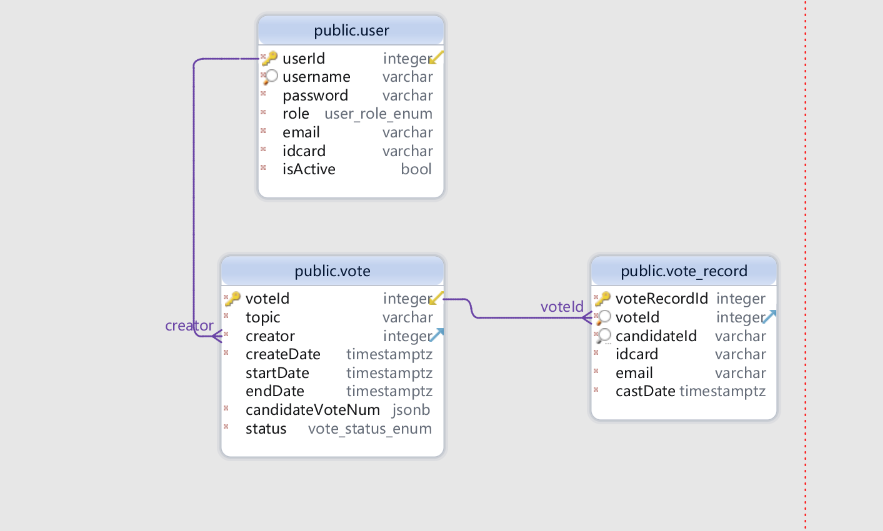

## Description

简易投票系统

## Installation

```bash
npm install
```

## Running the app

```bash
# dev
$ npm run start

# watch mode
$ npm run start:dev

```

## Test

```bash
# unit tests
$ npm run test

# e2e tests
$ npm run test:e2e

# test coverage
$ npm run test:cov
```

## API文档

使用ApiPost完成接口自测调试及[文档生成](https://console-docs.apipost.cn/preview/07079bc9cbf62033/9ff477ca38781583?target_id=905daf1b-5124-4e0c-ae57-ee41a49b74ae)


## 环境变量配置及默认值

```
# postgre连接相关配置
pg_host = localhost
pg_port = 5432
pg_username = postgres
pg_password = 123456
pg_database = vote-service

# reids连接配置
redis_host = localhost
redis_port = 6379

# 邮件服务相关参数
mail_auth_user = 1025605543@qq.com
mail_auth_pass = qqvlfiqctkgybcgc
mail_from_default = "难相见，易相别" <1025605543@qq.com>
```

## PostgreSQL数据库表结构设计



## 待续...